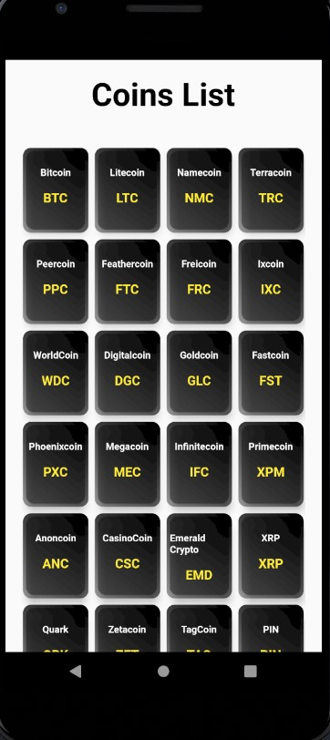
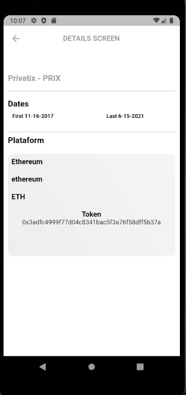

# coin_market

A new Flutter application.

The project runs in Flutter 2.0.4.

# About the important libs

I'm using bloc_pattern to control my state management, to navigate through the screens I use the Get lib.
In my request I got the Dio lib to rule it and Mokito lib to check my tests.

Application work flow.

First Screen will show all the coins and if you just click in one it show you the details.

 
